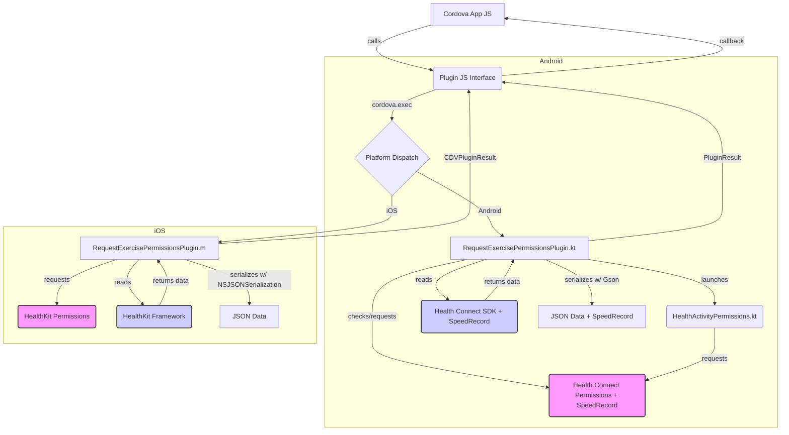

# System Patterns: Cordova Health Exercises Plugin (Android & iOS)

**Architecture:** Standard Cordova Plugin Architecture

*   **JavaScript Interface (`www/RequestExercisePermissionsPlugin.js`):** Exposes plugin functions (`requestPermissions`, `getExerciseData`) to the Cordova WebView. Uses `cordova.exec` to bridge calls to the appropriate native layer based on the platform.
*   **Native Kotlin Implementation (Android - `src/android/`):**
    *   `RequestExercisePermissionsPlugin.kt`: Extends `CordovaPlugin`. Handles actions dispatched from JavaScript. Interacts with the Health Connect SDK using Kotlin coroutines.
    *   `HealthActivityPermissions.kt`: Dedicated Android `Activity` for launching the Health Connect permission request flow.
*   **Native Objective-C Implementation (iOS - `src/ios/`):**
    *   `RequestExercisePermissionsPlugin.h` and `RequestExercisePermissionsPlugin.m`: Extends `CDVPlugin`. Handles actions dispatched from JavaScript. Interacts with the HealthKit framework using Objective-C.
*   **Configuration (`plugin.xml`):** Defines plugin ID, version, JS module. Contains platform-specific sections (`<platform name="android">`, `<platform name="ios">`):
    *   **Android:** Specifies Kotlin source files, feature mapping, Android permissions, `AndroidManifest.xml` entries (permissions activity/alias), and includes `android/build.gradle` via `<framework>`.
    *   **iOS:** Specifies Swift source file, feature mapping, links `HealthKit.framework`, adds `Info.plist` usage descriptions, and configures HealthKit entitlements directly using `<config-file target="*/Entitlements-*.plist">`.
*   **Build Configuration:**
    *   **Android (`android/build.gradle`):** Specifies dependencies (Health Connect client, Kotlin coroutines, Gson), configures source sets. (Note: Currently incomplete for a library plugin).
    *   **iOS:** Managed via `plugin.xml` framework linking, dependencies, and direct entitlement configuration.

**Key Technical Decisions:**

*   **Languages:** Kotlin for Android, Objective-C for iOS.
*   **Android Health Data:** Uses Google's Health Connect SDK.
*   **iOS Health Data:** Uses Apple's HealthKit framework.
*   **Asynchronous Operations:**
    *   Android: Kotlin coroutines (`runBlocking`, `async`, `launch`).
    *   iOS: HealthKit's asynchronous query completion handlers (`HKSampleQuery`, `requestAuthorization`). Main thread dispatch (`dispatch_async(dispatch_get_main_queue(), ^{...})`) used for Cordova callbacks. Uses Objective-C blocks and `dispatch_group_t` for managing concurrent queries. (Note: Potential retain cycle risk with blocks if `__weak` or `__unsafe_unretained` is not used). Result aggregation relies on implicit `dispatch_group_notify` queue behavior for thread safety.
*   **Permissions Handling:**
    *   Android: Dedicated Activity (`HealthActivityPermissions`) launched from the plugin.
    *   iOS: Uses `HKHealthStore.requestAuthorization`. Pre-query check in `getExerciseData` verifies core statuses are not `.notDetermined`. Distance sub-query proceeds if distance status is `.sharingAuthorized` or `.sharingDenied`. HealthKit entitlement configured directly in `plugin.xml`. Also requests permissions for `HKQuantityTypeIdentifierWalkingSpeed` and `HKQuantityTypeIdentifierStepCount`.
*   **Data Serialization:**
    *   Android: Gson library.
    *   iOS: `NSJSONSerialization`.
*   **Dependency Management:**
    *   Android: Via `android/build.gradle` referenced in `plugin.xml`.
    *   iOS: Via `<framework>` tags in `plugin.xml`.

**Component Relationships:**

**Critical Implementation Paths:**

1.  **Android Permission Request:** Cordova JS -> Plugin JS -> `execute("requestPermissions")` -> Kotlin `execute` -> `checkPermissions()` -> (If needed) `requestPermissions()` -> `HealthActivityPermissions.kt` -> Health Connect UI -> Callback to JS.
2.  **Android Data Fetching:** Cordova JS -> Plugin JS -> `execute("getExerciseData")` -> Kotlin `execute` -> `checkPermissions()` -> (If granted) `getExerciseData()` -> Coroutine launch -> Health Connect SDK query -> Aggregate data -> Serialize with Gson -> Callback to JS.
3.  **iOS Permission Request:** Cordova JS -> Plugin JS -> `execute("requestPermissions")` -> Objective-C `requestPermissions:` method -> `[HKHealthStore requestAuthorizationToShareTypes:readTypes:completion:]` -> HealthKit UI -> Completion Block -> `dispatch_async(dispatch_get_main_queue(), ^{...})` -> Callback to JS.
4.  **iOS Data Fetching:** Cordova JS -> Plugin JS -> `execute("getExerciseData")` -> Objective-C `getExerciseData:` method -> Check Core Auth (`!= HKAuthorizationStatusNotDetermined`) -> Parse Args -> `HKSampleQuery` for Workouts -> For each workout: `fetchSamplesForWorkout:completion:` (runs 4 sub-queries: Active Energy, Basal Energy, Distance [if status != HKAuthorizationStatusNotDetermined], Heart Rate) -> Use `dispatch_group_t` to wait for sub-queries -> Construct workout dictionary -> Use outer `dispatch_group_t` to wait for all workouts -> Aggregate results (no explicit locking) -> Serialize with `NSJSONSerialization` -> `dispatch_async(dispatch_get_main_queue(), ^{...})` -> Callback to JS.
