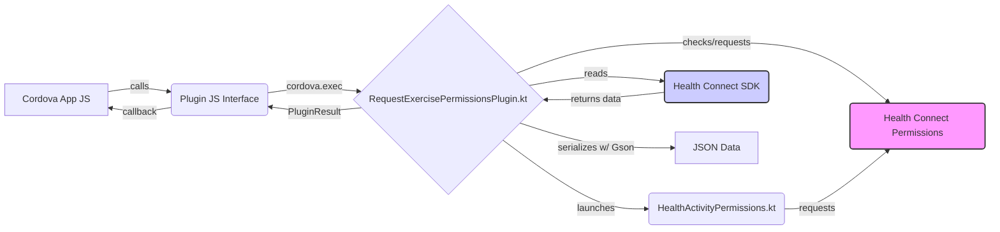

# System Patterns: Cordova Android Exercises Plugin

**Architecture:** Standard Cordova Plugin Architecture

*   **JavaScript Interface (`www/RequestExercisePermissionsPlugin.js`):** Exposes plugin functions (`requestPermissions`, `getExerciseData`) to the Cordova WebView. Uses `cordova.exec` to bridge calls to the native layer.
*   **Native Kotlin Implementation (`src/android/`):**
    *   `RequestExercisePermissionsPlugin.kt`: The main plugin class extending `CordovaPlugin`. Handles actions dispatched from JavaScript. Interacts with the Health Connect SDK using Kotlin coroutines for asynchronous operations.
    *   `HealthActivityPermissions.kt`: A dedicated Android `Activity` extending `CordovaActivity` responsible for launching the Health Connect permission request flow using `registerForActivityResult` and `PermissionController.createRequestPermissionResultContract()`.
*   **Configuration (`plugin.xml`):** Defines the plugin ID, version, JavaScript module, native source files, target directories, feature mapping, required Android permissions (including specific Health Connect read permissions), and AndroidManifest entries for the permissions rationale activity/alias. Includes a framework reference to `android/build.gradle`.
*   **Build Configuration (`android/build.gradle`):** Specifies dependencies (Health Connect client, Kotlin coroutines, Gson) and configures source sets to include Kotlin code.

**Key Technical Decisions:**

*   **Language:** Kotlin was chosen for the native Android implementation, leveraging its conciseness and coroutine support for interacting with the Health Connect SDK.
*   **Asynchronous Operations:** Kotlin coroutines (`runBlocking`, `async`, `launch` with `Dispatchers.IO`) are used for background processing when fetching data from Health Connect to avoid blocking the main thread.
*   **Permissions Handling:** A dedicated Activity (`HealthActivityPermissions`) is used to manage the Health Connect permission request flow, aligning with Android best practices. The main plugin class checks permissions before fetching data and initiates the request flow if needed.
*   **Data Serialization:** Gson library is used to serialize the fetched health data into a JSON string before returning it to the JavaScript layer.
*   **Dependency Management:** Plugin-specific dependencies are declared in `android/build.gradle`, which is included in the main app build via a `<framework>` tag in `plugin.xml`.

**Component Relationships:**

**Critical Implementation Paths:**

1.  **Permission Request:** Cordova JS -> Plugin JS -> `execute("requestPermissions")` -> `checkPermissions()` -> (If needed) `requestPermissions()` -> `HealthActivityPermissions.kt` -> Health Connect Permission UI -> `onRequestPermissionResult()` (in `HealthActivityPermissions`) -> Callback to JS.
2.  **Data Fetching:** Cordova JS -> Plugin JS -> `execute("getExerciseData")` -> `checkPermissions()` -> (If granted) `getExerciseData()` -> Coroutine launch -> `fetchExerciseData()`, `readDistanceData()`, etc. -> Health Connect SDK -> Aggregate data -> Serialize with Gson -> `PluginResult.Status.OK` -> Callback to JS.
